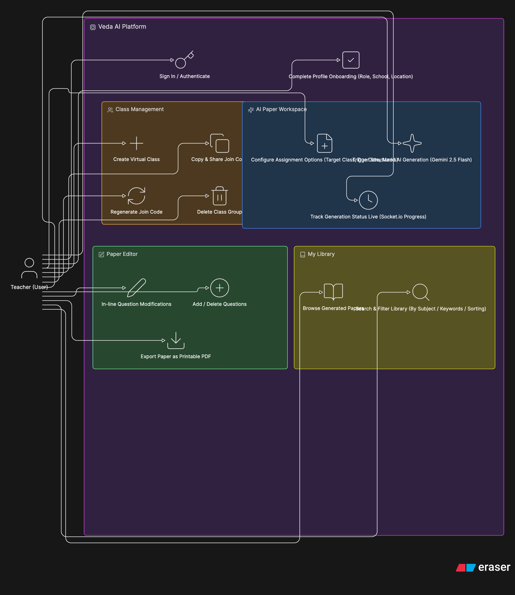
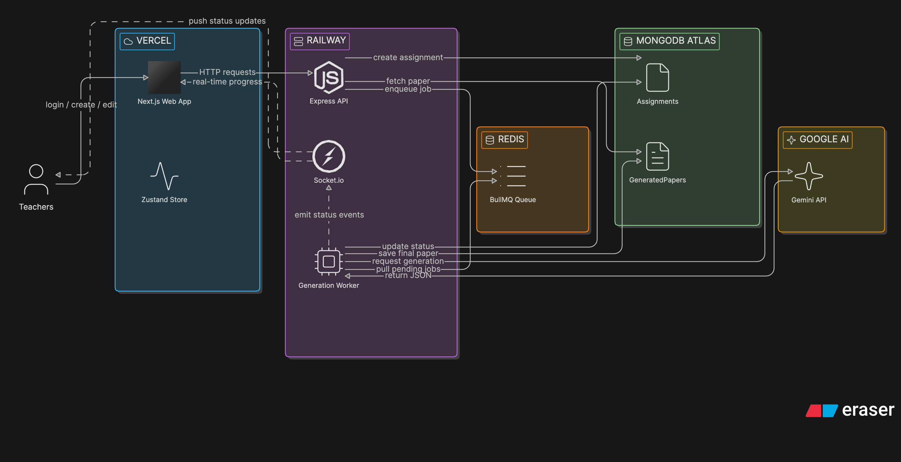

<h1 align="center">QuestAI</h1>

<p align="center">
  
  
  
  
  
  
  
  
  
  
  
</p>

---

QuestAI is a premium, state-of-the-art AI-powered assignment workspace built for teachers to generate and organize exam sheets in seconds.
By entering simple topics or instructions, teachers can instantly draft complete multi-section test papers with structured schemas. 

The system leverages standard Next.js App Router layout components on the frontend, Express and Socket.io on the backend, Upstash Redis and BullMQ queues for asynchronously running generators, and the Google Gemini API for high-fidelity structures.

---

## Technical Stack & Integrations

- **Frontend**: Next.js 14, Zustand State Stores, and Tailwind CSS.
- **Backend**: Express API Server, Socket.io (WebSocket statuses), and Puppeteer (for printable A4 PDF exports).
- **Security & Identity**: Clerk Authentication Middleware (`@clerk/nextjs` & `@clerk/backend` token verification).
- **Worker & Queues**: Redis (Upstash) + BullMQ asynchronous Job Processors.
- **AI Core**: Google Gemini API (`gemini-2.5-flash` model).
- **Database**: MongoDB Atlas and Mongoose Schema indexes.

---

## System Design Architecture
```text
┌────────────────────────────────┐
│       Next.js Web Client       │
│  - Zustand State Management    │
│  - Clerk Authentication Keys   │
│  - Socket.io Progress Listener │
└───────────────┬────────────────┘
                │
                │ HTTP REST / WebSockets
                │
                ▼
┌────────────────────────────────┐
│        Express Backend         │
│  - protectedProcedure auth     │
│  - Socket.io Realtime Server   │
│  - Mongoose DB Collections     │
│  - Puppeteer PDF Renderer      │
└──────┬──────────────────┬──────┘
       │                  │
       │                  │
       ▼                  ▼
┌─────────────┐    ┌─────────────┐
│   MongoDB   │    │ Redis Store │
│    Atlas    │    │   (Queue)   │
└─────────────┘    └──────┬──────┘
                          │
                          │ BullMQ
                          ▼
                   ┌─────────────┐
                   │   BullMQ    │
                   │   Worker    │
                   └──────┬──────┘
                          │
                          │ gemini-2.5-flash
                          ▼
                   ┌─────────────┐
                   │  Google AI  │
                   │ Gemini API  │
                   └─────────────┘
```

---

## Local Setup & Configuration

### Prerequisites
- Node.js 18+
- MongoDB database instance (Atlas free cluster or local container)
- Upstash Redis database (TCP connection URL)
- Clerk account credentials
- Google Gemini API Key

### 1. Backend Setup

```bash
cd backend
cp .env.example .env
```

Ensure your `.env` contains:
```env
PORT=5001
MONGODB_URI=your_mongodb_atlas_uri
REDIS_URL=your_upstash_redis_tcp_url
GOOGLE_GEMINI_API_KEY=your_gemini_api_key
FRONTEND_URL=http://localhost:3000
CLERK_SECRET_KEY=your_clerk_secret_key
CLERK_PUBLISHABLE_KEY=your_clerk_publishable_key
```

Install and run locally:
```bash
npm install
npm run dev
```

The server will initialize at `http://localhost:5001`.

### 2. Frontend Setup

```bash
cd frontend
cp .env.local.example .env.local
```

Ensure your `.env.local` contains:
```env
NEXT_PUBLIC_API_URL=http://localhost:5001/api
NEXT_PUBLIC_SOCKET_URL=http://localhost:5001
NEXT_PUBLIC_CLERK_PUBLISHABLE_KEY=your_clerk_publishable_key
CLERK_SECRET_KEY=your_clerk_secret_key
NEXT_PUBLIC_CLERK_SIGN_IN_URL=/sign-in
NEXT_PUBLIC_CLERK_SIGN_UP_URL=/sign-up
NEXT_PUBLIC_CLERK_AFTER_SIGN_IN_URL=/home
NEXT_PUBLIC_CLERK_AFTER_SIGN_UP_URL=/onboarding
```

Install and run locally:
```bash
npm install
npm run dev
```

The client dashboard will run at `http://localhost:3000`.

---

## Product Data Models

### `Assignment`
Represents a question paper generation request enqueued and managed by a teacher.

| Schema Field | Type | Required | Notes |
|:---|:---|:---:|:---|
| `userId` | String | Yes | Clerk unique user ID |
| `title` | String | Yes | Name of assignment |
| `subject` | String | Yes | Assignment subject line |
| `dueDate` | Date | Yes | Target timeline |
| `questionTypes` | [String] | Yes | Selected types |
| `numberOfQuestions` | Number | Yes | Total count |
| `totalMarks` | Number | Yes | Grade total |
| `difficulty` | String | Yes | `"easy" \| "medium" \| "hard"` |
| `additionalInstructions` | String | No | Custom instructions |
| `fileUrl` | String | No | Reference material URL |
| `status` | String | Yes | `"pending" \| "processing" \| "completed" \| "failed"` |
| `classId` | String | No | Target virtual class reference |

### `GeneratedPaper`
The output JSON structure generated by the BullMQ worker matching assignment details.

| Schema Field | Type | Required | Notes |
|:---|:---|:---:|:---|
| `assignmentId` | ObjectId | Yes | Maps to corresponding `Assignment` |
| `sections` | [Section] | Yes | Contains Section titles, instruction prompts, and [Question] items |

### `Class`
Virtual classroom created by teachers allowing student grouping.

| Schema Field | Type | Required | Notes |
|:---|:---|:---:|:---|
| `teacherId` | String | Yes | Owner Clerk user ID |
| `name` | String | Yes | Class group name |
| `subject` | String | Yes | Class subject |
| `grade` | String | Yes | Grades 1-12 standards |
| `joinCode` | String | Yes | Monospace 6-char alphanumeric join code |
| `studentIds` | [String] | Yes | Clerk enrolled student IDs |

---

## UseCase Diagram

## Screen Flow 

---

## Deployment Configuration

| Service Components | Hosting Platform | Runtime Environment / Configurations |
|:---|:---|:---|
| **Frontend** | **Vercel** | Next.js 14 App Router, production builds, Clerk JWT authentication |
| **Backend & Workers** | **Render** | Node.js web services, BullMQ workers, WebSocket support, Puppeteer dependencies |
| **Database Store** | **MongoDB Atlas** | Shared primary database replica sets |
| **Caching & Queues** | **Upstash Redis** | Serverless key-value instance (TCP connections) |

